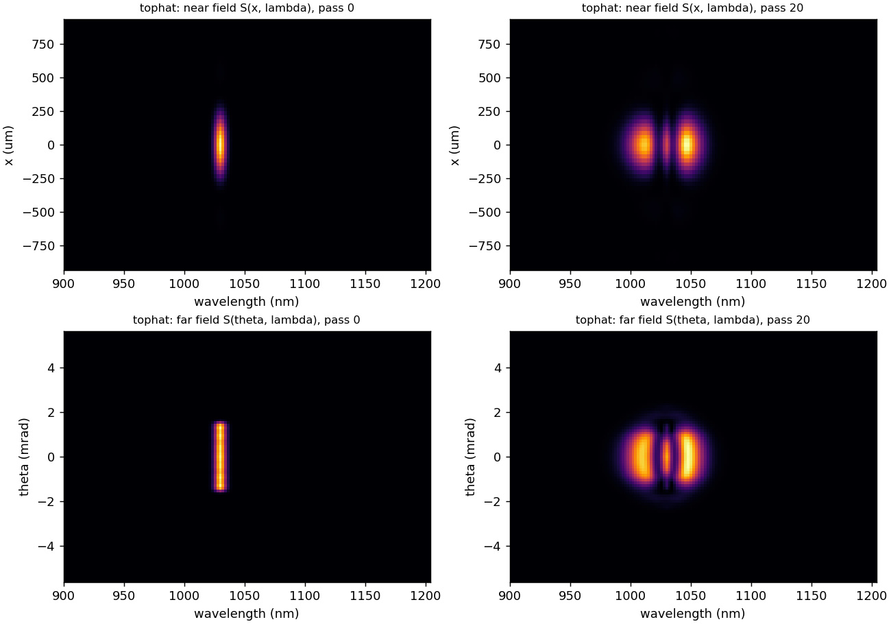

thunder4d.diagnostics
=====================

.. py:module:: thunder4d.diagnostics

All functions take ``grid`` and a field ``Aw`` in :math:`(x, y, \Omega)` (FFT order) and
return **sorted** axes. Wavelength-resolved densities are per unit wavelength unless
``per_lambda=False``.

Basic quantities
----------------

.. py:function:: spectral_support(grid, Aw, rel=1e-4)

   Indices of the frequencies carrying more than ``rel`` × the peak spectral energy.

.. py:function:: total_spectrum(grid, Aw, per_lambda=True)

   :returns: ``(lam, S)``, spatially integrated spectrum, ascending wavelength

.. py:function:: fluence(grid, Aw)

   :returns: :math:`F(x, y)` [J/m²]

.. py:function:: temporal_power(grid, Aw)

   :returns: ``(t, P)``, spatially integrated power [W]

Far field
---------

.. py:function:: far_field(grid, Aw, theta_max=None, n_theta=None, idx=None, theta_y=None)

   Angular spectrum :math:`E(\theta_x, \theta_y, \Omega)` on an angle grid **common to
   all colours**, computed exactly with a per-colour matrix Fourier transform. This is
   what is seen after collimating the output with a lens of focal length :math:`f`, at
   :math:`x = f\theta`.

   :param float theta_max: default: half the largest :math:`k_x` at :math:`\lambda_0`
   :param int n_theta: default: an odd number, so :math:`\theta = 0` is sampled
   :param theta_y: restrict to given :math:`\theta_y` values, e.g. ``[0.]``
   :returns: ``(theta_x, Ef)``, ``Ef`` of shape ``(n_theta, len(theta_y), Nt)``

Spatio-spectral traces
----------------------

.. py:function:: spectrogram_x_lambda(grid, Aw, y0=0.0, slit=None, axis="x", per_lambda=True)

   Imaging-spectrometer trace along a line, optionally integrated over a slit of width
   ``slit`` around ``y0``.

   :returns: ``(x, lam, S[x, lam])``

.. py:function:: spectrogram_theta_lambda(grid, Aw, theta_max=None, n_theta=None, per_lambda=True)

   Angle-resolved spectrum at :math:`\theta_y = 0`.

   :returns: ``(theta, lam, S[theta, lam])``

   :math:`S(x,\lambda)` (top) and :math:`S(\theta,\lambda)` (bottom), input and output.

Wavelength-resolved profiles
----------------------------

.. py:function:: band_indices(grid, lam_c, bandwidth=0.0)

   Frequency indices inside :math:`[\lambda_c - bw/2, \lambda_c + bw/2]` (nearest bin
   if ``bandwidth`` = 0).

.. py:function:: profiles_1d(grid, Aw, wavelengths, bandwidth=0.0, axis="x", mode="cut")

   1D beam profiles of selected wavelength bands plus the global (spectrally integrated)
   profile.

   :param str mode: ``"cut"`` (line through the axis) or ``"integrated"`` (projection,
      like a 1D camera lineout)
   :returns: ``(coord, profiles[n_lambda+1, N], band_energy[n_lambda+1])``; the last row
      / entry is the global profile / total energy [J]

.. py:function:: far_profiles_1d(grid, Aw, wavelengths, bandwidth=0.0, theta_max=None, n_theta=None)

   Same in the far field, cut at :math:`\theta_y = 0`.

   :returns: ``(theta, profiles[n_lambda+1, n_theta])``

Homogeneity
-----------

.. py:function:: homogeneity(grid, Aw=None, S_xyw=None, rel=1e-3)

   Spectral homogeneity of each pixel against the total spectrum :math:`S_0`:

   .. math::

      V(x, y) = \frac{\left(\sum_\lambda \sqrt{S(x,y,\lambda)\,S_0(\lambda)}\right)^2}
      {\sum_\lambda S \;\sum_\lambda S_0}.

   :math:`V = 1` is perfectly homogeneous. Pixels below ``rel`` × the peak fluence are
   NaN. Instead of a field, an intensity cube ``S_xyw`` can be given, e.g.
   ``abs(Ef)**2`` from :func:`far_field`, for the far-field homogeneity.

   :returns: ``(V_map, V_mean)``, ``V_mean`` fluence-weighted

Modal content
-------------

.. py:function:: mode_content(grid, Aw, w0_of_lambda, max_order=6, idx=None)

   Hermite–Gauss decomposition, frequency by frequency, on modes of waist
   ``w0_of_lambda(lam)`` with a flat phase (exact at the cell centre).

   :returns: dict with ``lam``, ``eta00`` (HG₀₀ fraction per wavelength),
      ``eta00_total``, ``order_frac`` (energy fraction per order :math:`m+n`; the last
      bin holds everything above ``max_order``)

Beam size and beam quality
--------------------------

.. py:function:: beam_moments(grid, Aw, idx=None)

   Per wavelength: second-moment radii ``wx``, ``wy`` [m] and ``M2x``, ``M2y`` from the
   Wigner moments
   :math:`M^2 = 2\sqrt{\langle x^2\rangle\langle k_x^2\rangle - \langle x k_x\rangle^2}`
   (centroids removed). Also returns ``lam`` and the spectrally weighted ``M2x_mean``,
   ``M2y_mean``.

   .. note::

      Second-moment quantities are sensitive to far wings: hard edges and Airy rings
      inflate :math:`M^2`.

Compression and chirp maps
--------------------------

.. py:function:: compress(grid, Aw, gdd_bounds_fs2=(-30000, 30000), tod_fs3=0.0, n_scan=61, rel=1e-4)

   Uniform GDD (e.g. chirped mirrors) maximising the peak of the spatially integrated
   power: coarse scan, then golden-section refinement. ``tod_fs3`` adds a fixed TOD.

   :returns: dict with ``gdd_fs2``, ``t_fs``, ``P`` (compressed :math:`P(t)` [W]),
      ``fwhm_fs``, ``tl_fwhm_fs`` (spatially resolved transform limit), ``peak_power``,
      ``peak_power_TL``, ``gdd_scan_fs2``, ``peak_scan``

.. py:function:: local_gdd_map(grid, Aw, rel_fluence=1e-2, rel_spectrum=1e-2)

   Pixel-wise GDD [fs²] from a spectrally weighted quadratic fit of the unwrapped
   spectral phase (radial chirp). NaN outside the beam.

.. py:function:: radial_profile(grid, M2d, nbins=None)

   Azimuthal average of a sorted 2D map.

   :returns: ``(r, value)``
