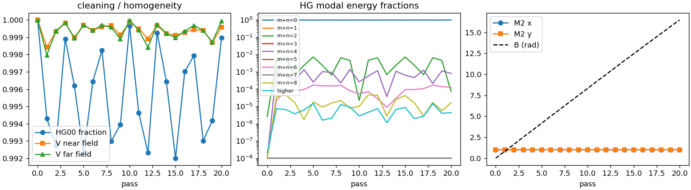
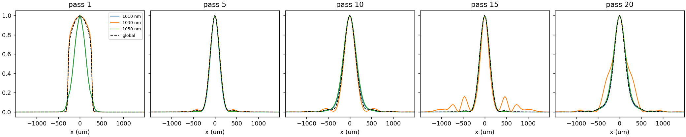
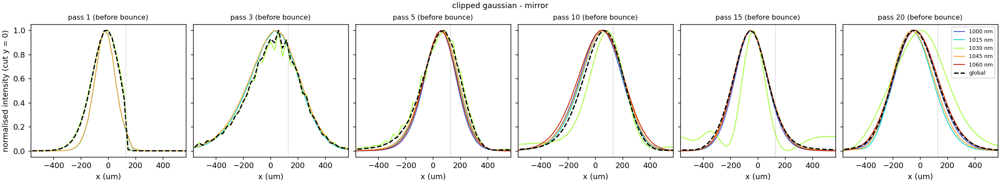
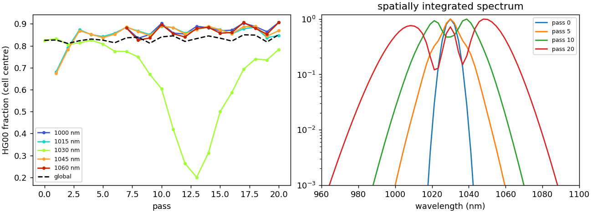

Examples
========

The example scripts in ``examples/`` use the same toy cell: argon at 1 bar,
:math:`R = 0.5` m, Herriott :math:`N = 10`, :math:`k = 3` (20 passes, 54° of Gouy phase
per pass) and 200 fs pulses at 1030 nm. Each runs in a few minutes on one core.

All scripts accept an optional time budget in seconds, write a checkpoint when it is
reached, and resume from it on the next launch:

.. code-block:: bash

   python clipped_gauss_profiles.py 600

Gaussian versus top-hat
-----------------------

``compare_gauss_tophat.py`` sends a matched Gaussian and a top-hat near field (Fourier
injection) through the same cell. Set ``QUICK = False`` for a template of a real stage.

Outputs (``out_gauss/``, ``out_tophat/``, ``run_*.npz``): spatio-spectral traces
:math:`S(x,\lambda)` and :math:`S(\theta,\lambda)` at input and output; HG₀₀ fraction,
homogeneity, mode orders, :math:`M^2` and B versus pass; :math:`\eta_{00}(\lambda)`;
fluence maps; radial GDD; compression.

   Matched Gaussian: the HG₀₀ fraction and the spectral homogeneity stay close to 1 up
   to B ≈ 16 rad.

.. figure:: ../_static/figures/tophat_spectrograms.png
   :width: 90%

   Top-hat (Fourier injection): spatio-spectral traces at the cell centre and in the
   far field, input (left) and output (right).

Wavelength-resolved profiles of a top-hat
-----------------------------------------

``tophat_profiles_vs_pass.py`` records the 1D profiles at 1010, 1030 and 1050 nm and
the global profile at every pass, at the cell centre, at the mirror and in the far
field. ``INJECTION = "mirror"`` images the near field on the first mirror;
``"fourier"`` puts the Airy pattern at the cell centre.

   Top-hat imaged on the mirror: profiles at the mirror plane. The fundamental keeps
   the top-hat structure while the colours generated by self-phase modulation are
   smooth.

Gaussian with a hard edge
-------------------------

``clipped_gauss_profiles.py`` clips a Gaussian with a knife edge at
:math:`x = +0.5\,w_\text{mirror}` (about 16 % of the beam), images it on the first
mirror, and records 1D profiles (linear and log scale) at 1000–1060 nm at the centre, at
the mirror and in the far field, plus :math:`\eta_{00}` of each colour versus pass.

   Mirror-plane profiles. The edge is visible at pass 1; from pass 5 on, the generated
   colours are smooth Gaussians.

   Left: HG₀₀ fraction of each colour versus pass. Right: spatially integrated
   spectrum.
