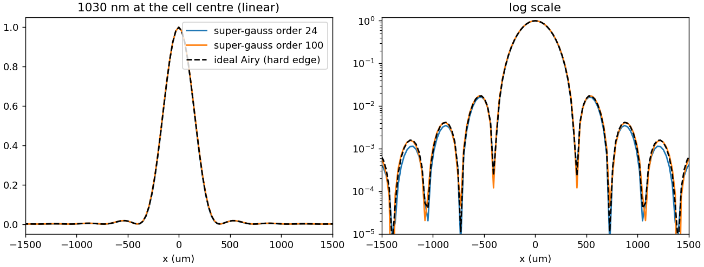

How to run the code
===================

A thunder4d simulation is a short Python script with five steps: medium and cell, grid,
pulse, simulation, analysis.

Minimal example
---------------

.. code-block:: python

   import thunder4d as m
   from thunder4d import diagnostics as dg

   # 1) medium and cell
   gas  = m.Material("Ar", pressure_bar=1.0)
   cell = m.MPC.herriott(R=0.5, N=20, k=3, branch="planar", medium=gas)  # 20 passes, 54 deg Gouy/pass, re-entrant

   # 2) grid sized from the cell
   grid = m.suggest_grid(cell, lambda0=1030e-9, lambda_min=900e-9, lambda_max=1200e-9,
                         pulse_fwhm=200e-15, box_factor=12)
   print(grid.describe())

   # 3) pulse: spectrum x spatial beam, with nonlinear mode matching
   E = m.gaussian_spectrum(grid, fwhm_fs=200)
   probe = m.Pulse.at_focus(grid, E, m.Beam(m.gaussian(1e-3)), 1.2e-3)
   mm = cell.match(probe)                      # prints P/Pc, matched waist, B per pass
   pulse = m.Pulse.at_focus(grid, E, m.Beam(m.gaussian(mm["w0"])), 1.2e-3)

   # 4) run
   sim = m.MPCSimulation(pulse, cell, phi_max=0.02, mode_reference=mm["w0"],
                         profile_wavelengths=[1010e-9, 1030e-9, 1050e-9],
                         profile_bandwidth=2e-9)
   sim.run()
   sim.save("run.npz")

   # 5) analysis
   x, lam, S = dg.spectrogram_x_lambda(grid, sim.Aw)
   c = dg.compress(grid, sim.Aw)
   print(f"{c['fwhm_fs']:.1f} fs with {c['gdd_fs2']:.0f} fs^2")

During the run, one line is printed per recorded pass:

.. code-block:: text

   pass  10/20 | B =   8.57 rad | E = 1.281 mJ | eta00 = 0.8406 | V_near = 0.9851 |
   V_far = 0.9849 | M2 = 1.440/1.045 | steps 476 | 214 s

Watch the energy column: see :doc:`advanced/validation`.

Defining the pulse
------------------

Spectrum
~~~~~~~~

.. code-block:: python

   E = m.gaussian_spectrum(grid, fwhm_fs=350)                    # or fwhm_nm=...
   E = m.measured_spectrum(grid, wl_nm, intensity)               # spectrometer data
   E = m.measured_spectrum(grid, wl_nm, intensity, phase_rad=ph) # + retrieved phase
   E = m.spectrum_from_temporal_field(grid, t_fs, field)         # retrieved pulse
   E = m.add_spectral_phase(grid, E, gdd_fs2=500, tod_fs3=2e3)

Spatial profile, aberrations and space-time couplings
~~~~~~~~~~~~~~~~~~~~~~~~~~~~~~~~~~~~~~~~~~~~~~~~~~~~~

A :class:`~thunder4d.pulse.Beam` combines a profile with aberrations and couplings:

.. code-block:: python

   beam = m.Beam(m.top_hat(4e-3),
                 zernike={"astig_0": 0.05, "coma_x": 0.02},     # RMS waves at lambda0
                 spatial_chirp_mm_per_nm=(0.01, 0),
                 pft_fs_per_mm=(2.0, 0))

   beam = m.Beam(m.knife_edge(m.gaussian(w), 0.5 * w, axis="x", side="+"))
   beam = m.Beam(m.measured_profile(camera_image, pixel_size=5.5e-6))

Injection into the cell
~~~~~~~~~~~~~~~~~~~~~~~

Where the beam is defined relative to the cell matters. A top-hat imaged on the mirror
and a top-hat Fourier-transformed at the cell centre are two different, equally
mode-matched inputs, and they evolve differently. Three builders are available:

.. list-table::
   :header-rows: 1
   :widths: 28 42 30

   * - Builder
     - Where the beam is defined
     - Typical use
   * - :meth:`Pulse.at_focus <thunder4d.pulse.Pulse.at_focus>`
     - directly at the cell centre
     - ideal matched Gaussian, tests
   * - :meth:`Pulse.from_near_field <thunder4d.pulse.Pulse.from_near_field>`
     - collimated near field in the front focal plane of an achromatic lens; the cell
       centre is the focal plane (exact per-colour Fraunhofer transform)
     - top-hat near field → Airy pattern at the centre
   * - :meth:`Pulse.imaged_near_field <thunder4d.pulse.Pulse.imaged_near_field>`
     - near field relay-imaged (same size for all colours) onto a plane, by default the
       mirror, with the mode's wavefront; then propagated back to the centre
     - flat-top on the input mirror at pass 1

.. code-block:: python

   # Airy pattern at the cell centre; lens chosen for the best overlap with the mode
   pulse = m.Pulse.from_near_field(grid, E, m.Beam(m.top_hat(4e-3)), energy,
                                   nf_size=12e-3, nf_points=192, target_waist=mm["w0"])

   # flat-top imaged on the first mirror (radius 1.12 x mode radius = best overlap)
   pulse = m.Pulse.imaged_near_field(grid, E, m.Beam(m.top_hat(1.12 * mm["w_mirror"])),
                                     energy, cell)

   Field at the cell centre produced by ``from_near_field`` for a top-hat near field,
   compared with the ideal Airy pattern.

Recording wavelength-resolved profiles
--------------------------------------

To follow the beam profile of individual colours pass after pass, give the wavelengths
and a bandpass width:

.. code-block:: python

   sim = m.MPCSimulation(pulse, cell,
                         profile_wavelengths=[1010e-9, 1030e-9, 1050e-9],
                         profile_bandwidth=2e-9,        # 0 = one spectral bin
                         profile_axis="x")

At every pass, the 1D profiles of each band and the global (spectrally integrated)
profile are stored at the cell centre (cut and projection), in the far field and at the
mirror plane. See :ref:`history-keys`.

Long simulations
----------------

Runs can be stopped and resumed:

.. code-block:: python

   import os
   sim = m.MPCSimulation(pulse, cell, phi_max=0.02)
   if os.path.exists("ckpt.pkl"):
       sim.resume("ckpt.pkl")
   sim.run(max_seconds=3600)        # stops cleanly after the pass exceeding 1 h
   sim.checkpoint("ckpt.pkl")
   if sim.done:
       sim.save("run.npz")

Output
------

``sim.history`` holds the per-pass diagnostics and ``sim.save(path)`` writes them to a
compressed ``.npz``. See :ref:`history-keys` for the full list.

.. code-block:: python

   import numpy as np
   d = np.load("run.npz")
   d["eta00_total"], d["V_far"], d["prof_mirror"], d["lam"]
