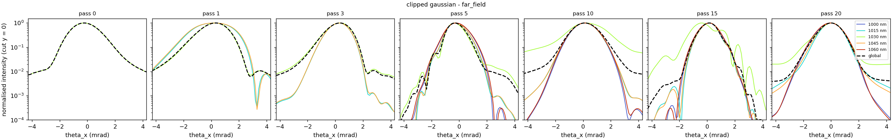

THUNDER4D documentation
=======================

**THUNDER4D** (*Transverse-resolved Herriott-cell UPPE solver for Nonlinear Dynamics close to
Experimental Reality, 4D*) is a 4D :math:`(x, y, z, t)` unidirectional pulse propagation (UPPE) code
for **gas-filled multipass cells** (MPCs) used for nonlinear post-compression of
ultrashort laser pulses.

Unlike 1D or radially symmetric codes, thunder4d resolves the full transverse field
:math:`A(x, y, t)` at every step. This makes it suited to questions such as:

- **spatial cleaning** of non-Gaussian inputs (top-hat, clipped or aberrated beams),
- **spatio-spectral homogeneity** and radial chirp of the output,
- **time-dependent nonlinear mode mismatch** (the pulse can only be matched at one power),
- the effect of **space-time couplings** (spatial chirp, pulse-front tilt, ...) on the output.

Main features:

- non-paraxial linear propagation with the full dispersion of the gas,
- Kerr nonlinearity with self-steepening,
- adaptive split-step scheme driven by the nonlinear phase per step,
- linear and **nonlinear (Kerr-lens) mode matching** of the cell,
- three ways of injecting the beam (at the focus, Fourier plane, near field imaged on
  the mirror),
- per-pass diagnostics: spatio-spectral traces :math:`S(x,\lambda)` and
  :math:`S(\theta,\lambda)`, Hermite–Gauss content, homogeneity, :math:`M^2`,
  wavelength-resolved beam profiles, compression,
- pure Python: NumPy (+ SciPy FFT if available), optional GPU through CuPy, resumable long runs.

   Far-field profiles of a Gaussian beam clipped by a knife edge, at selected
   passes and wavelengths. The colours generated by self-phase modulation carry one to
   two orders of magnitude less edge diffraction than the fundamental.

Contents of the documentation
-----------------------------

If you are new to THUNDER4D, read :doc:`overview/overview` first, then
:doc:`install/installation` and :doc:`how_to_run`. The :doc:`api_reference/api_reference`
lists every object of the package.

.. toctree::
   :maxdepth: 2

   overview/overview
   install/installation
   how_to_run
   examples/examples
   api_reference/api_reference
   advanced/advanced

Attribution
-----------

The dispersion of the gases follows Börzsönyi *et al.*, Appl. Opt. **47**, 4856 (2008).
The nonlinear mode matching follows the aberration-free Kerr-lens treatment used for
multipass cells (effective wavelength :math:`\lambda\sqrt{1-P/P_c}`).
